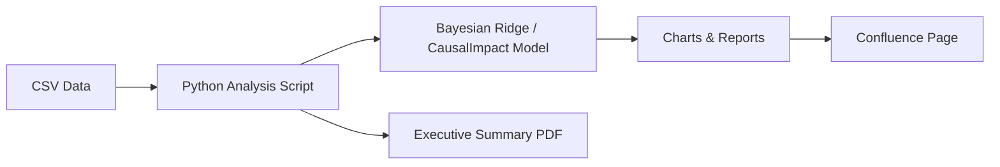

# Incrementality Analytics

An AI-powered skill that automates incrementality testing — measuring whether a marketing campaign (ads, promotions, spend changes) directly caused more installs, purchases, or revenue, versus users who would have converted anyway. Runs the full analysis and publishes results as a Confluence report, ready for stakeholders.

## What it does

- Estimates **counterfactual baselines** using Bayesian Ridge regression and CausalImpact
- Measures true incremental signups, purchases, and revenue from ad spend changes
- Supports **4 analysis approaches** matched to different intervention types
- Generates **charts, executive PDFs, and Confluence reports** ready for stakeholders
- Covers multi-region, multi-platform campaigns

## Architecture



## Analysis approaches

| Approach | When to use |
|---|---|
| **Standard Discrete** | Clean on/off spend switch with no overlap |
| **Dose-Response** | Progressive budget ramps — spend as a continuous variable |
| **Phase-by-Phase** | Multiple distinct spend levels tested sequentially |
| **Covariate Regression** | Overlapping campaigns where one channel is the treatment |

> Same dataset, different approach → materially different iCAC (€29–€44 on UK data). Approach selection is the most consequential decision.

## Setup

```bash
# Activate virtual environment (create one if needed)
python -m venv .venv && source .venv/bin/activate

# Install dependencies
pip install -r requirements.txt
```

## Running an analysis

```bash
python analysis/<project_name>/<script_name>.py
```

Outputs land in `analysis/<project_name>/` — charts (PNG), PDF reports, and a summary JSON.

## Project structure

```
incrementality_analytics/
├── analysis/                    # Completed analyses (gitignored — contains sensitive campaign data)
├── evals/                       # Validation datasets for testing approach selection
├── .claude/
│   └── skills/
│       ├── incrementality-testing/     # Core methodology skill (approach selection, model config)
│       └── incrementality-confluence/  # Confluence publishing skill (business-friendly tone)
└── requirements.txt
```

## Dependencies

| Library | Role |
|---|---|
| `tfcausalimpact` | Bayesian structural time-series model |
| `scikit-learn` | BayesianRidge regression for short pre-periods |
| `pandas` / `numpy` | Data manipulation |
| `matplotlib` / `seaborn` | Charting and PDF generation |
| `scipy` / `statsmodels` | Statistical tests and diagnostics |
| `python-dotenv` | Loads environment variables from `.env` |

## License

MIT License — see [LICENSE](LICENSE)
