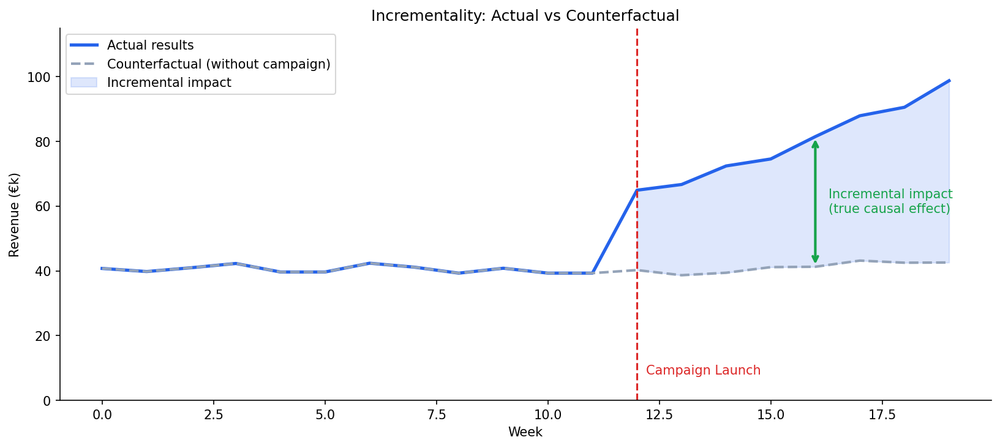
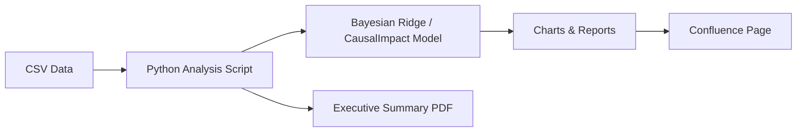

# Incrementality Analytics

An AI-powered skill that measures whether a marketing campaign actually **caused** more revenue — or whether those customers would have converted anyway.

---

## The problem with standard attribution

Most marketing teams rely on attribution (last-click, multi-touch, platform-reported ROAS). The problem: attribution *when available (no privacy limitations)* tells you *who converted after seeing an ad* — not *whether the ad caused the conversion*.

This leads to two opposite mistakes:

**Overcounting** — attribution inflates credit for customers who would have bought regardless:
- Attribution says: "1,000 users clicked and bought" → €100k revenue
- Reality: "Only 400 were truly driven by the campaign" → €40k true impact

**Undercounting** — privacy gaps and walled gardens hide real conversions (iOS, Meta, programmatic, offline):
- Attribution says: "200 tracked conversions" → €20k revenue
- Reality: "True impact was 600 conversions" → €60k actual contribution

**Incrementality testing measures the real number — whether attribution over- or understates it.**

---

## What incrementality looks like visually

The core question incrementality answers: *"What would have happened if we hadn't run this campaign?"*

That imagined baseline is called the **counterfactual**. The gap between actual results and the counterfactual is the true incremental impact.



- **Blue line** — what actually happened after the campaign launched
- **Dashed grey line** — the counterfactual: what the model predicts would have happened without the campaign
- **Shaded area** — the incremental impact: revenue your campaign genuinely caused

Before the campaign launch (left of the red line), both lines track together — that's the model learning the normal pattern. After launch, the gap opens. That gap is what you're paying for.

---

## What it does

- Estimates **counterfactual baselines** using Bayesian Ridge regression and CausalImpact
- Measures true incremental signups, purchases, and revenue from ad spend changes
- Supports **4 analysis approaches** matched to different intervention types
- Generates **charts, executive PDFs, and Confluence reports** ready for stakeholders
- Covers multi-region, multi-platform campaigns

---

## Analysis approaches

| Approach | When to use |
|---|---|
| **Standard Discrete** | Clean on/off spend switch with no overlap |
| **Dose-Response** | Progressive budget ramps — spend as a continuous variable |
| **Phase-by-Phase** | Multiple distinct spend levels tested sequentially |
| **Covariate Regression** | Overlapping campaigns where one channel is the treatment |

> Same dataset, different approach → materially different iCAC (€29–€44 on UK data). Approach selection is the most consequential decision.

---

## Architecture


```mermaid
flowchart LR
    A[CSV Data] --> B[Python Analysis Script]
    B --> C[Bayesian Ridge / CausalImpact Model]
    C --> D[Charts & Reports]
    D --> E[Confluence Page]
    B --> F[Executive Summary PDF]
```

---

## Setup

```bash
# Activate virtual environment (create one if needed)
python -m venv .venv && source .venv/bin/activate

# Install dependencies
pip install -r requirements.txt
```

## Running an analysis

```bash
python analysis/<project_name>/<script_name>.py
```

Outputs land in `analysis/<project_name>/` — charts (PNG), PDF reports, and a summary JSON.

---

## Project structure

```
incrementality_analytics/
├── analysis/                    # Completed analyses (gitignored — contains sensitive campaign data)
├── evals/                       # Validation datasets for testing approach selection
├── .claude/
│   └── skills/
│       ├── incrementality-testing/     # Core methodology skill (approach selection, model config)
│       └── incrementality-confluence/  # Confluence publishing skill (business-friendly tone)
└── requirements.txt
```

---

## Dependencies

| Library | Role |
|---|---|
| `tfcausalimpact` | Bayesian structural time-series model |
| `scikit-learn` | BayesianRidge regression for short pre-periods |
| `pandas` / `numpy` | Data manipulation |
| `matplotlib` / `seaborn` | Charting and PDF generation |
| `scipy` / `statsmodels` | Statistical tests and diagnostics |
| `python-dotenv` | Loads environment variables from `.env` |

---

## License

MIT License — see [LICENSE](LICENSE)
